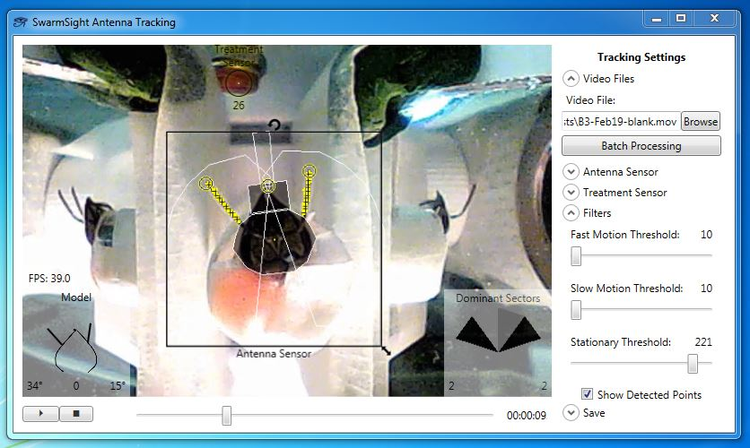
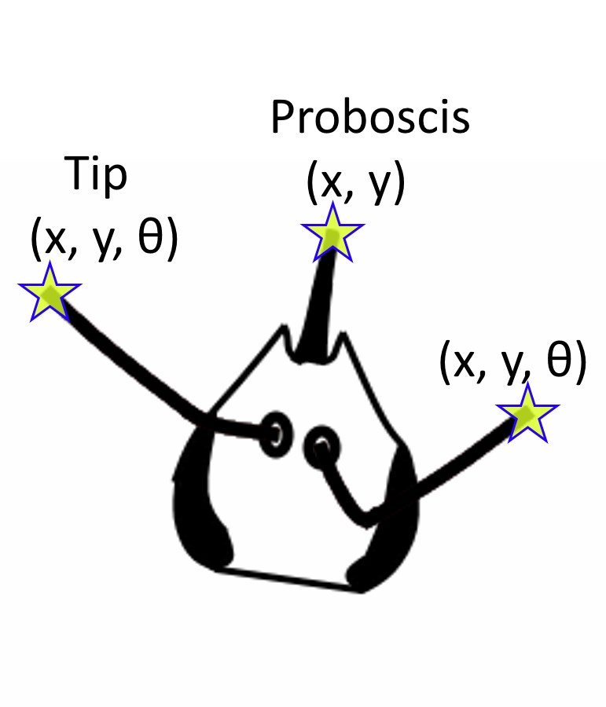

# Insect Antenna and Proboscis Location Tracking

SwarmSight Antenna Tracking module will analyze videos of restrained insects, filmed from the top-down view, and provide the user with the antenna and proboscis tip locations for each frame of the video.

Insect heads filmed from the top-down view can be analyzed by the software. Below is an example setup for filming a honey bee that is delivered an odor stimulus. The bee and its head is restrained from movement, and the camera is positioned above the head on a tripod.

The user positions the Antenna Sensor widget, adjusts the filter, and exclusion zone settings.

The program computes the antenna and proboscis tip locations, and saves the data into a .CSV file that can be opened with most statistical software packages.

# Download, Install, and Analyze Example Video

1. Download the latest [SwarmSight Antenna Tracking installer](https://github.com/JustasB/SwarmSight/raw/master/Setup/AntennaTracking/setup.exe) 
2. Download [an example video](https://github.com/JustasB/SwarmSight/raw/master/Examples/Appendage%20Tracking/B1-Feb22-heptanal.mov)
3. Open the installer in Windows OS, and follow the steps on screen
4. The installer will download, install, create shortcuts, and launch the app. The app can be launched from Start Menu > SwarmSight > SwarmSight Antenna Tracking
5. Using the app, open the example video, position/scale/rotate the AntennaSensor widget over the head, and play the video. You may need to adjust filter settings in the "Filters" panel on the right.
6. Once the video finishes playing, save the tracking data using the "Save" panel on the right. The .csv file will be saved in the same folder as the video.

# Video Tutorials for Install, Output File, and Analysis

Files used in the tutorial can be found in [the Examples folder](https://github.com/JustasB/SwarmSight/tree/master/Examples/Appendage%20Tracking/Birgiolas%20et.%20al.%20(2015)%20JOVE%20figures/Figures%204%265). You can also [download and unzip the full repository](https://github.com/JustasB/SwarmSight/archive/master.zip).

# Output File Reference
The columns of the output .CSV file are described in [the Output Column Reference](Examples/Appendage%20Tracking/ColumnReference). See video tutorials for how to analyze the .CSV files.

# Society for Neuroscience 2016 Poster
You can download the conference [poster](https://github.com/JustasB/SwarmSight/raw/master/Examples/SwarmSight%20Antenna%20Tracking%20Poster.pdf) and the [abstract](https://github.com/JustasB/SwarmSight/raw/master/Examples/SwarmSight%20Antenna%20Tracking%20Abstract.pdf) describing the software validation and findings.

# Funding

Development of this software was supported in part by grant R01MH1006674 from NIH to SM Crook and NSF Ideas lab project on ‘Cracking the olfactory Code’ to BH Smith. 
